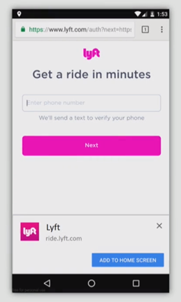

PWAs are web applications developed using a number of **specific technologies and standard patterns** to allow them to take advantage of both web and native app features.

To name few, let me list down few technologies help to build a complete PWA. Here are they

-   [Client-side storage — IndexedDB](https://developer.mozilla.org/en-US/docs/Learn/JavaScript/Client-side_web_APIs/Client-side_storage)
-   [Service Workers](https://developer.mozilla.org/en-US/docs/Web/API/Service_Worker_API/Using_Service_Workers)
-   [Cache Web API](https://developer.mozilla.org/en-US/docs/Web/API/Cache)
-   [Push Notifications API](https://developer.mozilla.org/en-US/docs/Web/API/Push_API)
-   [Manifest files](https://developer.mozilla.org/en-US/Apps/Progressive/Add_to_home_screen)
-   [and more…](https://developer.mozilla.org/en-US/Apps/Progressive)

Before digging deeper into PWA, let’s first compare normal web applications and native applications (like iOS Apps, Android Apps)

### Pros of Web Applications:

-   Easily discoverable — via search engines, URLs
-   Easier to use — No installation needed
-   Share the web apps easily using the links

### Pros of Native Applications:

-   Better integration with Operating System _(Make use of device inbuilt sensors)_
-   It even works offline _(After installing Angry Birds game, you can play even without internet)_
-   It just sits on your home screen

---

**PWAs are somethings that give you the power of both native and web applications!**

---

### PWA in Action

This section is for folks who haven’t experienced Progressive Web App before. I’ll try to explain using a set of screenshots.

**Lyft** is a ride sharing application based out of US. What you are seeing is just their website/web application on Google Chrome Mobile (Android).

In case if you haven’t noticed already, there is a small pop up at bottom of the screen, with an action button saying “**ADD TO HOME SCREEN**”. With just one tap on that button, this web application will be downloaded/added to your home screen.

PS: _This modal will pop only for returning users. So that people cannot feel like it’s spamming._

As we discussed, you can find the application icon on your home screen.

We just added a normal website to your homescreen!!! Isn’t that exciting?!

**_Yes it is!_**

Of course we can click that icon. This is what you get after you click it.

It will open up its own [Splash Screen](https://en.wikipedia.org/wiki/Splash_screen). And all the properties on this screen are editable/programmable using a file called manifest.webmanifest _(that we’ll discuss later in this article)._

Finally the PWA is opened on the device. You may notice that this application is not bounded inside a chrome browser. Because, it is a standalone.

It feels like a native app, that you downloaded from Google Play Store.

It will be on your device, unless you remove it manually.

### **To Summarize, an Ideal PWA should**

-   Start and run really fast
-   Work across variety of devices
-   Run over HTTPS _(You may wonder, why it needs HTTPS. It’s because PWA use_ [**_Service Workers_**](https://developer.mozilla.org/en-US/docs/Web/API/Service_Worker_API/Using_Service_Workers) _to intercept network requests. Service worker will not work in normal HTTP due to some security reason.)_
-   Just be on your Home screen like a native app
-   Work offline and reliable under poor n/w conditions
-   Can view and send push notifications even when the application is closed/inactive.

### Why PWAs making buzz nowadays?

1.  PWAs run seamlessly irrespective of devices. No need to write/maintain separate code base for every platform. It just works fine irrespective of all platforms. Because PWAs just need a browser engine, and that is available by default on all devices! _(feeling blessed being a PWA dev :P)_

2\. Companies in the name of cost cutting, hesitating to pay different developers separately — in our case iOS, Android and Web devs.

For example, twitter discontinues its support of Twitter App for Mac. See the below tweet.

3\. Microsoft is considering PWAs as first class citizens on Windows 10. See below news release from Microsoft.

I feel that above three reasons are good enough to justify why PWAs are making buzz these days. I hope you too felt the same.

### PWAs that are Live today

Let’s quickly see few production PWAs which are successful.

1.  **Flipkart Lite**

To my knowledge, Flipkart did the very first Progressive Web App and called it as Flipkart Lite. Google officially [announces](https://developers.google.com/web/showcase/2016/flipkart) that **Flipkart Lite** is the most successful PWA ever developed.

2\. **Twitter Lite**

Twitter’s **Twitter Lite** looks and feels like a native app, you do not believe it is a PWA. I personally use Twitter Lite for my daily use.

3\. **Microsoft Teams**

Microsoft has announced new Enterprise application called Microsoft teams. It is a team collaboration app for professionals. This PWA is built using web technologies like Angular, Typescript, sass, etc., _(see below tweet)_

### Finally, It’s time for coding!

A full-fledged PWA will do more things. But now let’s just focus on two parts.

1.  Adding an option to your existing web application — “**Add to home screen**”
2.  Scratch the surface of Service Workers by implementing some offline functionalities.

**Adding to Home Screen**

To add an option in your existing app to “Add to home screen”, you just need to add the following manifest file in your index.html file like below.

And the following is your manifest file that we linked above.

Above manifest file has full control over the styling of your PWA (as shown in the image below) We can control background color of splash screen, icon and text to be displayed, etc.,

Just by adding above manifest file, you have taken the first step in the world of PWA. It’s very simple, right?! So the next step is.

**Adding offline functionality**

To add offline functionality, we need to intercept HTTP/network requests of your applications. For that you need a new file called Service Worker.

To brief, Service worker is a [web worker](https://www.w3schools.com/html/html5_webworkers.asp), it is not a part of your web application and **doesn’t have any control over your DOM**. But all the network requests from your application will go through your logic written in this service worker javascript file. As we speak, most of the browsers support service workers, but to validate that use the below snippet in your index.js file.

If service worker is compatible in your browser, then it will register service worker js file to your web application (in this case, we call this file as **sw.js** — mostly located at root directory of the project)

Service worker works based on various [life cycle events](https://developers.google.com/web/fundamentals/primers/service-workers/lifecycle) like **install, fetch, activate**, etc.,

**Install** event occurs, when the sw.js is registered to your web application. In that event callback, you can do initial things like caching the necessary assets in your browser, as did in the below sw.js file.

Heads up: [Cache API](https://developer.mozilla.org/en-US/docs/Web/API/Cache) is used in the below code snippet.

So now we added all necessary assets under ‘**cache-store**’ cache block in your browser. Our next step is to intercept each and every network request in your app and if the request url matches a cached asset, your sw.js will just return it from cache without letting go out to external network. Otherwise make network request. In the below code snippet sw.js file does the same thing.

As we already discussed, service worker is event based. So whenever a network request occurs, fetch event is initiated in the sw.js file _(as did in above code snippet)_

Congratulations! You have just completed your first progressive web app with both **add to home screen** feature and **offline** functionality.

To get more hands on, feel free to have a look at these sample pwa projects on github by Mozilla.

[**mdn/pwa-examples**  
_pwa-examples - Examples for progressive web apps._github.com](https://github.com/mdn/pwa-examples "https://github.com/mdn/pwa-examples")

Feel free to share your thoughts in comments below. If you would like, follow me on [Twitter](https://twitter.com/knowinmins).

Kindly refer to below links to learn more…

-   Mozilla documentation on PWA — [https://developer.mozilla.org/en-US/Apps/Progressive](https://developer.mozilla.org/en-US/Apps/Progressive)
-   Simple PWA Project — [https://github.com/mdn/pwa-examples/tree/master/a2hs](https://github.com/mdn/pwa-examples/tree/master/a2hs)
-   Lighthouse Auditor for PWAs — [https://developers.google.com/web/tools/lighthouse/](https://developers.google.com/web/tools/lighthouse/)
-   Windows Blog — [https://blogs.windows.com/msedgedev/2018/02/06/welcoming-progressive-web-apps-edge-windows-10/#xiY7r8j1pIxzB3F2.97](https://blogs.windows.com/msedgedev/2018/02/06/welcoming-progressive-web-apps-edge-windows-10/)

Happy hacking!!!
