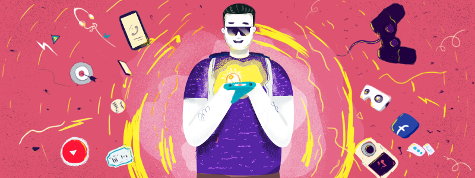

It was a weekend, I’ve been browsing and watching a playlist (which I bookmarked) on YouTube. I came across a contest on the [AWS site](https://aws.amazon.com/), it is about creating [Serverless Apps for social good](https://serverlessrepo.devpost.com/). Since it was a good initiative, I wanted to share it on [my twitter profile](https://twitter.com/knowinmins/).

Keeping this in mind, I opened the Twitter site. A friend of mine retweeted a Motion poster of an upcoming film of a favorite Tamil actor. I was pretty excited, clicked the link and I redirected to YouTube and watched it a couple of times. After watching it, I shared the video link in our WhatsApp group and kept as my WhatsApp status as well. Due to some unknown reasons, I deleted the status after a while.

It has been around 10 minutes, then I resumed the playlist that I was watching in the beginning. Only then I realized that I forgot/missed to post the tweet about the contest.

So I reopened Twitter, this time one of my favorite designers shared his achievement and thanked the audience. Since he is from my native, I was a bit overwhelmed and retweeted his post with my wishes. After that, I found a vlogger I follow shared a video — it was an ad for a brand new car. Believe me, it was very creative.

It was a lot of time already, then I rushed to watch the playlist again.

Alas, I still didn’t post the tweet about the contest. I felt like man what am I doing. So for the third time, I logged into Twitter and [finally posted it](https://twitter.com/knowinmins/status/1038332959860776960).

Though it sounds funny, its no longer an unusual thing. We all do this every day unconsciously. But not all of us have realized this pretty serious thing.

Researches proved that our productivity steeply reduces when we keep switching between these distractions. It is highly necessary to be self-aware and conscious about the things we do all the time. Otherwise, a good amount of time in our lifespan will be wasted with or without our knowledge.

Recently I started to research more about in these areas, where our well being is taken away by this tech (like social media apps, push notifications, etc.,). This is the serious issue that has to be fixed. This article is my first step in this movement.

Because I feel like our life is something more than sharing WhatsApp status, watching YouTube videos, wishing our friends on their birthdays and expecting likes/reactions for the funny memes we post on Facebook(which was actually created by someone else).

To mention, this year Google in its IO event had made a big announcement about [Digital Well Being](https://wellbeing.google/). Though it is getting a mixed response, it should be welcomed since a tech giant is taking a huge leap.

If you want to learn more about this topic, I recommend you watch interviews/talks by this person — [Tristan Harris](http://www.tristanharris.com/), who is a pioneer in this area.

I just wanted to share my thoughts via this small blog post, Hope you had a good read. Show your feedback in the form comments or claps, which help me a lot.
