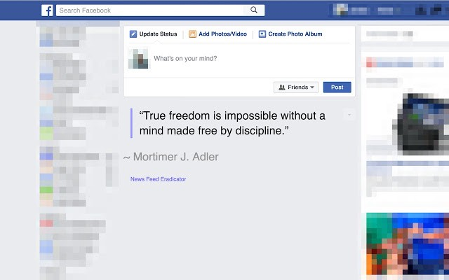
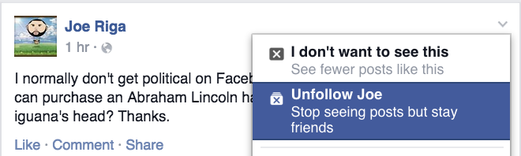
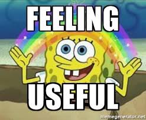

It was mid-2011, I created my Facebook account and exploring it. I was pretty excited and created a group for my school friends and started sharing my thoughts and a few funny videos.

Since then Facebook as a product slowly developed and a whole bunch of features has been added to keep us more engaged — Like reminding Birthdays of our friends, look backs, added 4 new expressions along with the like button, and the list goes.

Subconsciously Facebook has become a part of our day to day life. If I was using my laptop for personal or work reasons, it is so common that my fingers press the keyboard shortcut **_CTRL + T_** (to open a new browser tab) and type **_F key_** (this auto-populates facebook.com on the address bar) and then I hit enter.

This loop cycles for at least once in every hour of my day. If I get into Facebook, I’ll take at least 10 minutes to come out of it. All those 10 minutes are spent scrolling some funny memes and videos. An interesting thing is, 7 out of 10 posts I saw during that time is shared by a few of my connections (Let’s say 3). They are super active on Facebook and their sharing frequency is extremely high. If I’m not wrong, they were sharing a post every 5 minutes.

At that time I was researching about **Time Well Spent** concept. I found a few extensions that mitigate this habit. One of the extensions is [Facebook news feed eradicator](https://chrome.google.com/webstore/detail/news-feed-eradicator-for/fjcldmjmjhkklehbacihaiopjklihlgg?hl=en).

This extension will replace the news feed with a random quote every time you load Facebook.

> **One may ask what is the purpose of this extension… I’d say its purpose is sending you back to the real work as quickly as possible :D**

I was using this extension for a couple of weeks. I never regretted. It was fun.

Later I somehow uninstalled this extension and found that there is no purpose in blaming Facebook for keeping us hooked with it. It does provide a lot of options and so that we can have the control over our feeds.

### Time to unfollow

Then I decided to unfollow the oversharers and the pages of no use. Though I value them personally, we have to value our precious time as well. It’s not their mistake either. We cannot blindly blame anyone other than us. **Doing this made my Facebook feed more relevant and sustainable.** I started seeing pics with real people instead of the funny memes.

But I didn’t stop there. I want to use Facebook to its fullest. So I joined the groups which match my areas of interest and share my works and findings there. Since all the members of the group are like-minded, the conversations turned more healthy. I know this will help me to build my network, where you’ll find a partner for your own startup or land in your dream job. Anything can happen.

> Now I’m finding Facebook more useful.

The main thing is whenever we are used to something for quite a long time, we should stop ourselves doing it blindly and think what’s going wrong, what’s going right and whether anything can be improved.

In one word, we have to be more **CONSCIOUS** about what we do.

This is what I wanted to share in this blog. Hope you had a good read if so show some love by clapping and share your thoughts on the comments section below.

Let's get connected on [Twitter](https://twitter.com/knowinmins).
